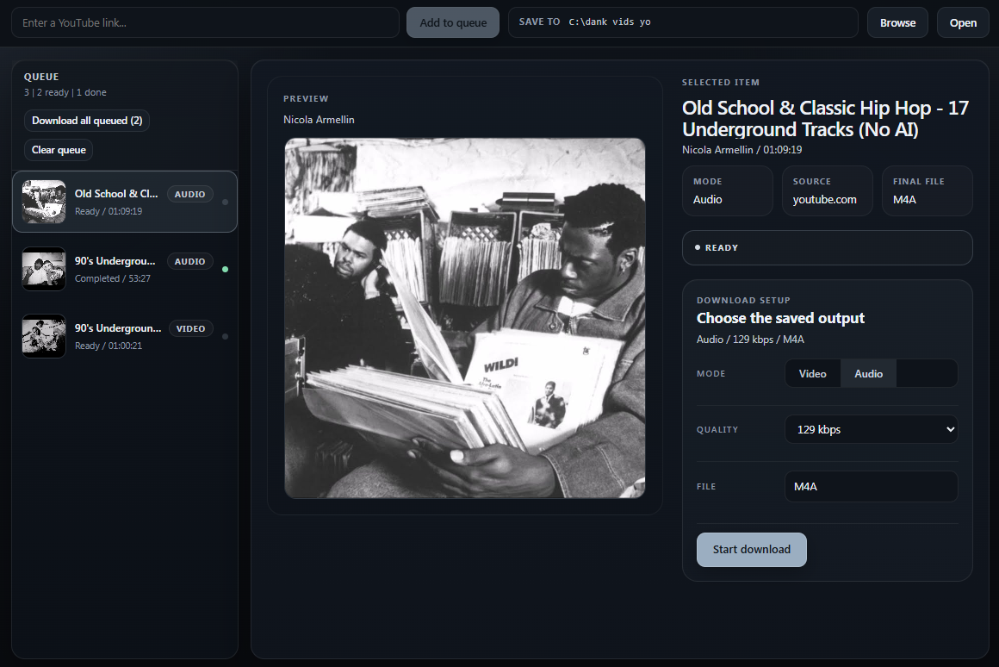

# Back in my days Youtube

Back in my days Youtube is a Windows app for downloading YouTube audio or video without fighting with a dozen menus first.
Paste a link, choose audio or video, pick the quality you want, and save the file where you want it.

## Download

Get the current installer from [GitHub Releases](https://github.com/Rasslabsya4el/Back-in-my-days-Youtube/releases/latest).
The public release format is the Windows installer: `Back in my days Youtube Setup.exe`.

If Windows SmartScreen appears, click `More info`, then `Run anyway`.

## What the buttons do

- `Add to queue`: adds the YouTube link from the input field.
- `Browse`: lets you choose the folder for the current session.
- `Open`: opens the current output folder in Explorer.
- `Audio` / `Video`: switches the selected item between audio download and video download.
- `Quality`: chooses the saved quality for the selected item.
- `Start download`: starts the currently selected item.
- `Download all queued`: starts every queued item.
- `Clear queue`: removes queued items that have not started yet.

## How to use it

1. Download `Back in my days Youtube Setup.exe` from [Releases](https://github.com/Rasslabsya4el/Back-in-my-days-Youtube/releases/latest).
2. Run the installer and start the app.
3. Paste a YouTube link and click `Add to queue`.
4. If needed, click `Browse` and choose another folder.
5. Click the item in the queue, choose `Audio` or `Video`, then pick the quality you want.
6. Click `Start download` or `Download all queued`.
7. Click `Open` when the file is ready.

## How the screen is laid out

- The top bar is for the link and the output folder.
- The left side is the queue. That is where you pick the item you want to work on.
- The main panel shows the selected item, its preview, the mode switch, the quality picker, and the main download button.

## Need help

- Releases: [github.com/Rasslabsya4el/Back-in-my-days-Youtube/releases](https://github.com/Rasslabsya4el/Back-in-my-days-Youtube/releases)
- Issues: [github.com/Rasslabsya4el/Back-in-my-days-Youtube/issues](https://github.com/Rasslabsya4el/Back-in-my-days-Youtube/issues)
- If the app itself fails to start, the installer build writes a log to `C:\ProgramData\Back in my days Youtube\logs\debug.log`.

## Why is the installer so large

The installer is intentionally heavier than the UI alone.
Most of the size comes from the bundled runtime pieces the app needs to start cleanly on Windows, especially the built-in WebView2 runtime and the bundled media tools.

I made that tradeoff because I want the app to be as close as possible to "download, install, run" on any Windows PC without asking you to install extra dependencies first or relying on whatever old version happens to already be on the machine.

That same reason is why the installed app also takes more space than the interface itself would suggest.

## Technical runbook

Build, packaging, local start, smoke checks, and runtime notes live in [docs/technical-runbook.md](docs/technical-runbook.md).
